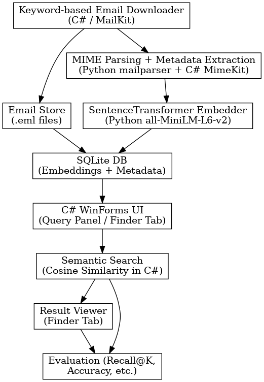
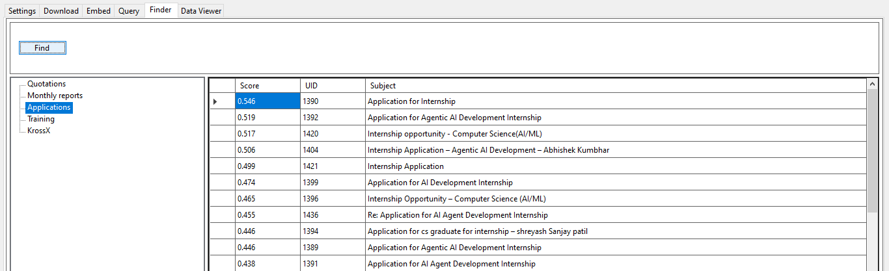
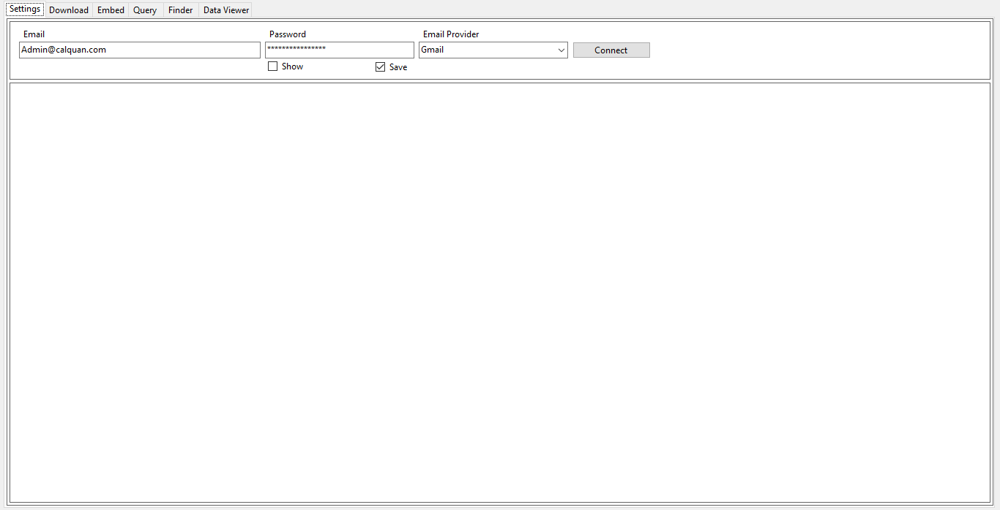
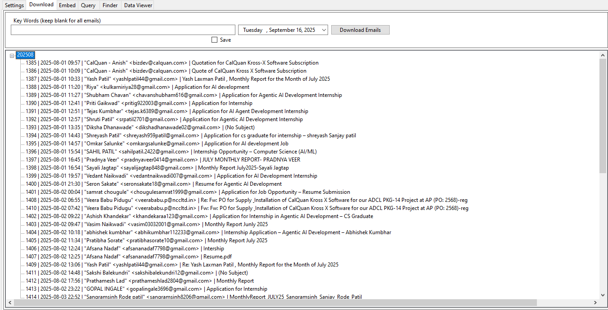
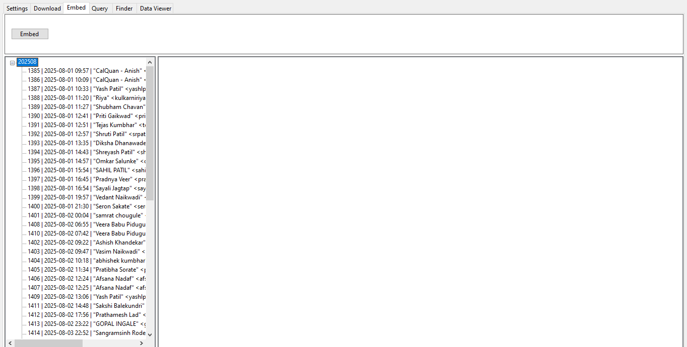
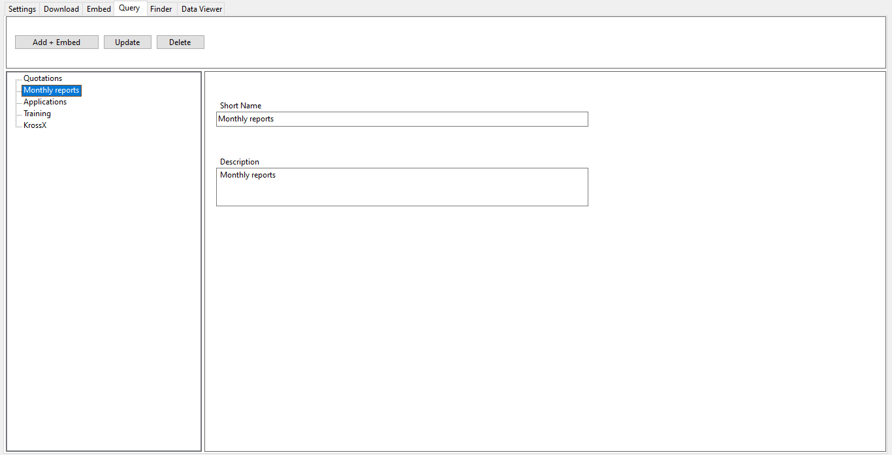
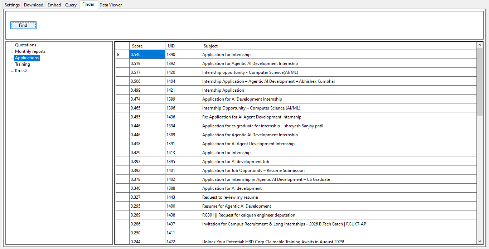
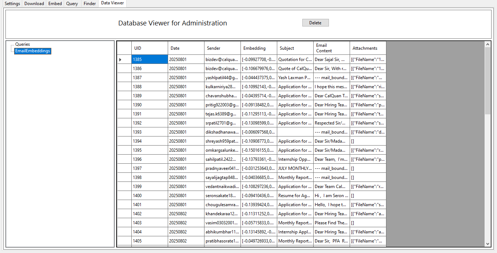

# 📧 SmartEmail

Video: [Watch Demo](https://www.youtube.com/watch?v=D0VbAtFDrxc)

---
## 🚀 Introduction

**AI-powered Email Extraction & Semantic Search Assistant**  
A hybrid **C# WinForms desktop application** with a **Python backend** for embeddings and semantic retrieval.  
**SmartEmail** connects to IMAP mailboxes, applies **keyword-based filtering** for selective downloads, embeds emails using **SentenceTransformer (`all-MiniLM-L6-v2`)**, and lets you run **semantic queries** against a local SQLite database.  

---
## ⚙️ Tech Stack

- 🖥️ **Frontend:** C# (.NET 8, WinForms)  
- 📬 **Email Handling:** MailKit, MimeKit  
- 🧠 **AI/ML:** Python, SentenceTransformers (`all-MiniLM-L6-v2`), Mailparser  
- 💾 **Database:** SQLite (via Microsoft.Data.Sqlite)  
- 🔗 **Interop:** C# ↔ Python process calls, JSON serialization  

---

## 📌 TL;DR

- **Frontend:** C# WinForms UI (`frmMain`) with tabs for Settings, Download, Embedding, Query Management, Finder, and Data Viewer  
- **Backend:** Python scripts (`generate_embeddings.py`, `generate_query_embeddings.py`) invoked from C# for email + query embeddings  
- **Database:** SQLite stores embeddings, metadata, queries, and search vectors  
- **Workflow:** IMAP → keyword/date-based email downloads (**stored month-wise**) → embeddings → SQLite → semantic queries ranked by relevance → Data Viewer for inspection  

---

## ✨ Features

- 🔐 **IMAP Connectivity** – Works with Gmail, Outlook, Yahoo, Rediffmail, Zoho Mail, and any other IMAP-enabled provider  
- 📥 **Flexible Download** – Download emails by **date** (with optional **keyword filtering**). Stored locally and **grouped month-wise**  
- 🧠 **Embeddings** – Generate semantic vectors for emails + attachments (`all-MiniLM-L6-v2`)  
- 💾 **SQLite Storage** – Stores emails, metadata, queries, and embeddings locally  
- 🔎 **Semantic Search** – Finder tab ranks emails against queries by relevance  
- 🗂️ **Query Management** – Store queries with short names + descriptions (embedded)  
- 📂 **Data Viewer** – Inspect embeddings and database tables visually  
- 🖥️ **Rich Desktop UI** – Tabbed navigation with Settings, Finder, Embedding, and more  

---

## 📐 Architecture

- **Email Downloader (C# / MailKit):** Connects via IMAP, downloads `.eml` files  
- **Parsing & Embeddings (Python):** Extracts subject/body/attachments, generates vectors with SentenceTransformers  
- **Database (SQLite):** Stores embeddings, metadata, and queries  
- **Desktop UI (C# WinForms):** Tabs for Settings, Download, Embedding, Finder, and Data Viewer  
- **Semantic Search (C# + Python):** Query embeddings compared with stored vectors → Top-K results returned  

 

---

## 📊 Evaluation

### Main Testing – Query Evaluation

**Test Setup:**  
- 60 emails downloaded and embedded (no keyword filtering)  
- 5 distinct queries tested for relevant email retrieval  

| Query Category     | Relevant Emails | Top-5 Hits | Top-10 Hits | Recall@5 | Recall@10 | Precision@5 | Precision@10 | Hit@5 | Hit@10 |
|--------------------|----------------:|-----------:|------------:|---------:|----------:|-------------:|--------------:|------:|-------:|
| Monthly Reports    | 8               | 5          | 7           | 62.5%    | 87.5%     | 100.0%       | 70.0%         | ✅     | ✅     |
| Applications       | 20              | 5          | 10          | 25.0%    | 50.0%     | 100.0%       | 100.0%        | ✅     | ✅     |
| KrossX             | 13              | 5          | 10          | 38.5%    | 76.9%     | 100.0%       | 100.0%        | ✅     | ✅     |
| Quotations         | 9               | 1          | 2           | 11.1%    | 22.2%     | 20.0%        | 20.0%         | ✅     | ✅     |
| Training           | 1               | 0          | 1           | 0.0%     | 100.0%    | 0.0%         | 10.0%         | ❌     | ✅     |
| **Overall Avg**    | —               | —          | —           | **27.4%**| **67.3%** | **64.0%**    | **60.0%**     | ✅ 4/5| ✅ 5/5 |

**Run date:** Sept 16, 2025  

---

## 🖼️ Screenshots
  

  
  
  

  
  
  

---

## 📑 Application Pages

- **Settings** – Configure email, app-specific password, and select provider  
- **Download** – Fetch emails via IMAP, filter by date/keywords, view month-wise tree  
- **Embed** – Generate embeddings; unembedded emails highlighted in red  
- **Query Management** – Add/update/delete queries; tree shows short names; repopulate textboxes  
- **Finder** – Run semantic queries; results ranked by relevance with score, UID, subject  
- **Data Viewer** – Inspect database tables and embeddings (emails + queries)  
---

## 📖 Technical Details

For details about architecture and applicaion pages, please see [**TECHNICAL_DETAILS.md**](TECHNICAL_DETAILS.md).

---

## ⚠️ Limitations

- Requires **SentenceTransformer model** (`all-MiniLM-L6-v2`), not domain-specific  
- Email parsing may skip non-textual or exotic attachments  
- Works only on **Windows (.NET WinForms)**  
- No real-time sync with live inbox (**manual downloads only**)  

---

## 🛣️ Roadmap

- 🌐 Web-based UI (Streamlit/React)  
- 📈 Scale beyond SQLite (FAISS/ChromaDB backend)  
- 🤝 Multi-user mode + shared DB  

